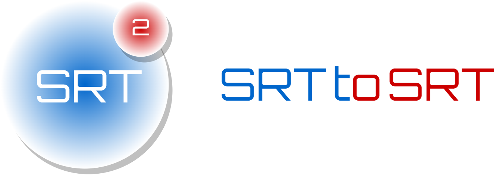
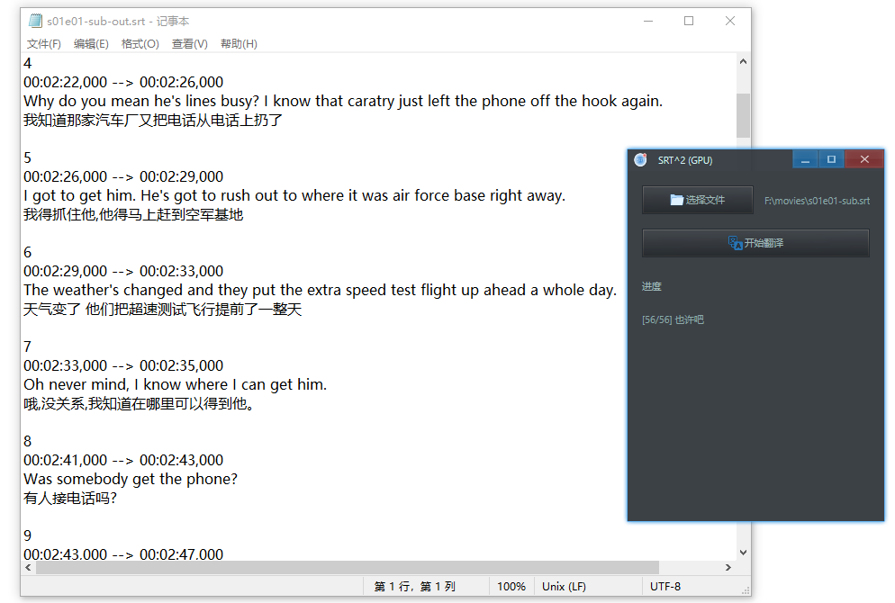

<p align="center">
    
</p>

<div align="center">

[](https://github.com/rerender2021/srt2srt/actions/workflows/build.yml) [](https://github.com/rerender2021/srt2srt/actions/workflows/pack.yml)

 </div>
 
# 简介

SRT to SRT (SRT^2) 是一个简单的翻译器，原理：

-   使用本地离线翻译服务器，逐行读取字幕文件进行翻译。目前支持离线情况下，英文翻译成中文。
-   GUI 部分则是使用 [Ave React](https://qber-soft.github.io/Ave-React-Docs/) 开发的。



<!-- 演示视频见:

- [回声：实时英语语音翻译](https://www.bilibili.com/video/BV11L411d7HE/) -->

# 使用说明

-   软件首页：https://rerender2021.github.io/products/srt2srt/

# 开发者向

## 本地开发

```bash
> npm install
> npm run dev
```

开发过程中需要确保本机启动了翻译服务器。可以使用CPU的，也可以使用支持GPU的。

### CPU

-   CPU 翻译服务器：https://github.com/rerender2021/NLP-API/releases/tag/1.0.1

下载后，解压到项目下，确保项目目录结构如下：

```
- nlp-server
    - NLP-API.exe
    - ...
- src
- ...
- package.json
```

### GPU

-   GPU 翻译服务器：https://github.com/rerender2021/NLP-GPU-API/releases/tag/1.0.0
  
下载后，解压到项目下，确保项目目录结构如下：

```
- nlp-gpu-server
    - NLP-GPU-API.exe
    - ...
- src
- ...
- package.json
```

## 打包发布

-   生成 exe

```bash
> npm run release
```

# 开源协议

[MIT](./LICENSE)

# 赞赏

`:)` 如果此软件值得赞赏，可以请作者看小说，一元足足可看八章呢。

<p align="left">
    
</p>
